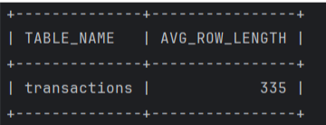
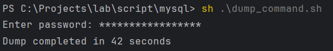
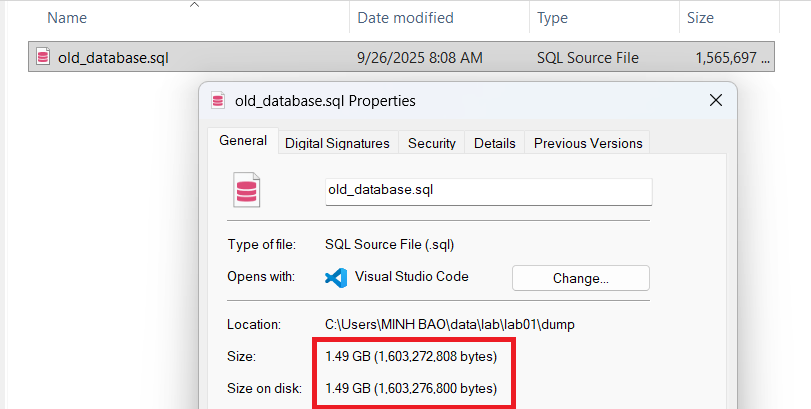
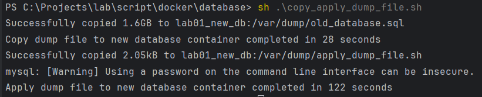

# LAB 01 - DATABASE MIGRATION

## Definition

In software development, there are cases where we need to migrate
from an old database to a new one.

**Requirements:**
- No downtime. Users must use the system normally during migration.
- Emergency rollback. If something happens during migration, such as
  writing to the new database fails, we must rollback to the old database.
- Correctness. The old and new databases must be the same and consistent.

## Technologies

### Debezium

A service that captures all row-level changes in the database,
so applications can respond to them.

### Kafka

A streaming platform, popular for scalability and throughput.
It is also a message queue, supporting async communication between services.

#### Kafka Connect

A service in the Kafka ecosystem. It gets data from a source,
transforms it, then puts it to a sink.

### Mysqldump
A tool to create a logical snapshot of a MySQL database.
A logical snapshot is a set of SQL statements that can recreate the database.

## Task
You must migrate the database from the lab01_old_db container
to the lab01_new_db container.
The migration must satisfy all conditions listed above.

**Database details:**
- Database name: luke
- Table: Transactions (9 million rows)

### Prepare Lab Data

## Migration Approaches

### Naive Approach

#### Analysis

When I worked at my first company, I needed to migrate a MySQL database
from an old server to a new server.
The reason was a server and network restructure. My team's services
belonged to another network cluster, so we needed to move the database
and service to a new cluster.

My approach was very naive:
- Stop the service
- Dump the database using mysqldump
- Apply the dump to the new server
- Start the service, using the new database

This way is simple, but has a big disadvantage:
Downtime is large if the database is large.

My boss accepted this way because downtime was allowed.
The DB was used for admin tools and contained statistics data
of a payment system, aggregated by day.
Admin service listened for transaction change events in a message queue,
then updated the corresponding statistics row.
During downtime, transaction change messages were still stored in the queue,
so I did not lose data.
After each day, I performed a full scan of transactions for the day
on the main payment service and corrected the statistics data.
So the correctness of the statistics database was kept.
Admin tools were used by internal users like POs and directors.
I asked my boss for downtime at 7pm, so nobody used it during migration.
In summary, the downtime did not have a big impact on the service or users.

Performance of mysqldump depends on:
- Disk read/write throughput
- Network throughput if mysqldump client and MySQL server are on different servers
- Size of the database

I do not remember exactly how much time my first migration took,
but it was less than 1 minute because:
- All disk throughput was used for mysqldump since the service was stopped
- The database was very small, storing only statistics like revenue,
  number of transactions for each tuple (status, merchant, product, zone, day)

For this lab, I checked the average row size with:
```SQL
select TABLE_NAME, AVG_ROW_LENGTH from INFORMATION_SCHEMA.tables where TABLE_NAME = "transactions";
```



Each row in the transactions table averages 335 bytes,
so the database size is 335 x 9M = 1.5 GB.

Stopping the service before dumping is crucial.
Any writes during dumping are not included in the dump.
When the new database applies the dump, it does not have these new writes,
resulting in data loss.

#### Stop the Service
This is the first step in the naive migration approach.
You must ensure that no writes are performed, otherwise they will be lost.

#### Dump the Old Database
Before dumping, mysqldump requires the PROCESS privilege.
Login as root, then use this SQL to grant PROCESS privilege
to the account used for mysqldump:
```SQL
grant process on *.* to 'luke_luke'@'%'
```
I used the luke_luke account for mysqldump, so I granted PROCESS privilege to it.

The mysqldump command is written in [mysql dump command](../script/mysql/dump_command.sh).
Change the username from my name (luke_luke) to your name.
You can also change the result file for mysqldump.
Then execute this command:
```sh
# Working directory: mysql
sh .\dump_command.sh
```

Result:




It took 42 seconds to dump the database,
and the file size is about 1.5 GB.

#### Apply the Dump File
In this step, you apply the dump file to the new database.
In my first migration, I simply logged in to the new server,
executed mysqldump on the old database, and applied the dump file.

In this lab, you can do the same.
But since I created the dump file on the host,
I first need to copy the dump file from the host to the new database container,
then apply it.

You can copy and apply the dump file by running:
```sh
# Working directory: script/docker/database
sh .\copy_apply_dump_file.sh
```

This script copies the dump file to /var/dump/old_database.sql.
Then it copies apply_dump_file.sh to /var/dump and executes it.
apply_dump_file.sh simply applies the dump file to the SQL server running in the container.

Result:



It took 28 seconds to copy the dump file to the new container,
and 122 seconds to apply the dump file to the new server.

#### Start the Service and Use the New Database
Now, simply start the service and use the new database.

### Reducing Downtime
You can see that downtime for the naive approach is high.
My database size is only 1.5 GB, no network throughput needed
because I work at localhost and all disk throughput is used for migration,
but it took 42 + 28 + 122 seconds to migrate.
With large databases in TB units, network and disk throughput is not high,
downtime could be hours. How can we reduce it.
